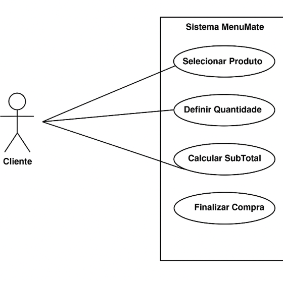

# DESCRIÇÃO DO PROJETO
O MenuMate é o aplicativo perfeito para quem busca praticidade, rapidez e variedade ao fazer pedidos online. Com uma interface intuitiva e de fácil navegação, o app permite que você encomende alimentos, bebidas, produtos de supermercado, de maneira rápida e segura.
# OBJETIVO DO PROJETO
  Facilitar o processo de compra e entrega de produtos e serviços ao usuário, proporcionando uma experiência rápida, prática e segura. Seu foco principal é conectar consumidores a fornecedores locais (restaurantes, lojas, mercados, farmácias, etc.), permitindo que façam pedidos de forma conveniente e recebam suas compras diretamente no local desejado, com a opção de pagamento online e rastreamento em tempo real.
# FERRAMENTAS A UTILIZAR
•	SQL Server: Gerenciamento de banco de dados dos clientes, pedidos e catálogos.

•	Netbeans: Desenvolvimento do aplicativo para Android e iOS.

•	Pencil: Criação de wireframes e protótipos da interface do usuário.

•	GitHub: Controle de versão e colaboração entre desenvolvedores.

•	Miro (Kanban): Organização e gestão das tarefas do projeto.

# FUNCIONALIDADES DO PROJETO

1.	Cadastro e Login do Usuário
o	Criação de conta com nome, e-mail, senha e telefone.

2.	Sugestões Inteligentes
o	Recomendações baseadas em pedidos anteriores.
o	Sugestão de promoções personalizadas.

3.	Gerenciamento de Pedidos
o	Adicionar/remover itens do carrinho.
o	Resumo detalhado do pedido.
o	Confirmação e rastreamento do pedido.

4.	Pagamento e Confirmação
o	Múltiplos métodos de pagamento (crédito, débito, Pix, etc.).
o	Validação automática do pagamento.

5.	Histórico de Pedidos
o	Consulta de pedidos anteriores.
o	Avaliação de fornecedores e produtos adquiridos.

6.	Promoções e Ofertas
o	Exibição de ofertas personalizadas.
o	Notificações sobre promoções em fornecedores favoritos.

7.	Perfil do Cliente
o	Edição de informações pessoais.
o	Gerenciamento de preferências de compra.
o	Personalização das notificações.

  O diagrama representa um caso de uso do sistema MenuMate, mostrando as interações dos usuários com suas funcionalidades.
•	O Login permite acesso ao sistema, podendo incluir o Registro.
•	A função Visualizar pode ser estendida para Filtrar informações.
•	Gerenciar pedidos inclui ações como Finalizar pedido, que por sua vez pode estender o Pagamento.
•	O sistema também permite visualizar o Histórico de Pedidos e acessar Promoções.

  O diagrama representa um banco de dados para um sistema de pedidos em restaurantes. Ele contém as entidades Cliente, Restaurante, MenuMate e Sistema de Pagamento, conectadas por relacionamentos.
•	Cliente armazena informações do usuário, como nome, e-mail e senha.
•	Restaurante possui dados sobre comidas e bebidas disponíveis.
•	MenuMate gerencia promoções, sugestões e o cardápio.
•	Sistema de Pagamento contém métodos e valores das transações.
Os relacionamentos mostram que clientes interagem com restaurantes e fazem pedidos através do menu, enquanto o sistema de pagamento processa as compras.

#	BANCO DE DADOS
2.1.1	Banco de Dados: SQL Server
O SQL Server foi escolhido como banco de dados para o projeto por várias razões, incluindo:
1.	Confiabilidade e Desempenho: O SQL Server é amplamente utilizado em projetos corporativos por ser robusto, escalável e garantir alto desempenho no gerenciamento de grandes volumes de dados.
2.	Segurança: Ele oferece recursos avançados de segurança, como criptografia de dados, auditoria e controle de acesso granular, essenciais para garantir a proteção de dados dos clientes e informações financeiras.
3.	Integração com o .NET: O SQL Server integra-se bem com o ambiente de desenvolvimento baseado em .NET (com o uso do NetBeans para o backend), facilitando a comunicação entre o aplicativo e o banco de dados.
4.	Facilidade de Administração: O SQL Server tem ferramentas de administração poderosas, como o SQL Server Management Studio (SSMS), para facilitar a gestão do banco de dados.
________________________________________
2.1.2	Dados a serem armazenados
A seguir, estão os dados principais que serão armazenados no banco de dados:
1.	Clientes:
o	ID do Cliente: Identificador único para cada cliente.
o	Nome: Nome do cliente.
o	Email: Endereço de e-mail do cliente (para envio de promoções, notificações, etc.).
o	Telefone: Número de telefone de contato.
o	Histórico de Pedidos: Registro dos itens pedidos pelo cliente, para personalizar recomendações.
2.	Cardápio:
o	ID do Prato/Bebida: Identificador único para cada item no cardápio.
o	Nome do Prato/Bebida: Nome do item.
o	Descrição: Descrição detalhada do prato ou bebida.
o	Categoria: Categoria do item (ex: entrada, prato principal, sobremesa, bebida).
o	Preço: Valor do item.
o	Imagem: URL da imagem do item no cardápio.
3.	Pedidos:
o	ID do Pedido: Identificador único do pedido.
o	ID do Cliente: Relacionamento com a tabela de clientes.
o	Data/Hora do Pedido: Quando o pedido foi feito.
o	Status do Pedido: Status do pedido (ex: em preparo, concluído, cancelado).
o	Itens do Pedido: Itens específicos do pedido (relacionamento com a tabela de cardápio).
4.	Promoções:
o	ID da Promoção: Identificador único da promoção.
o	Nome da Promoção: Nome ou descrição curta da promoção.
o	Tipo de Promoção: Tipo de desconto ou oferta (ex: "compre uma pizza, ganhe uma sobremesa").
o	Data de Início: Quando a promoção começa.
o	Data de Término: Quando a promoção termina.
o	Itens Associados: Quais pratos ou bebidas estão vinculados à promoção.
5.	Preferências de Cliente:
o	ID da Preferência: Identificador único para cada conjunto de preferências.
o	ID do Cliente: Relacionamento com a tabela de clientes.
o	Preferências Alimentares: Ex: vegano, sem lactose, etc.
o	Gosto Pessoal: Preferências como "gosta de pratos doces", "prefere algo leve", etc.
________________________________________

CREATE DATABASE CardápioDigitalPersonalizado;
USE CardápioDigitalPersonalizado;

CREATE TABLE Usuario (
    id_cliente INT PRIMARY KEY IDENTITY(1,1),
    email VARCHAR(255) NOT NULL UNIQUE,
    senha VARCHAR(100) NOT NULL,
    nome VARCHAR(100) NOT NULL,
    cpf CHAR(14) NOT NULL UNIQUE,
    data_nascimento DATE
);
CREATE TABLE Produtos(
id INT PRIMARY KEY IDENTITY(1,1),
nome VARCHAR(50) NOT NULL,
estoque INT NOT NULL,
preco FLOAT NOT NULL, 
tamanho INT,
)
GO
CREATE TABLE Clientes(
id INT PRIMARY KEY IDENTITY(1,1),
nome VARCHAR(45) NOT NULL,
cpf CHAR(15) NOT NULL,
email VARCHAR(45) NOT NULL,
telefone VARCHAR(45) NOT NULL
)
GO

CREATE TABLE CarrinhoCompra(
id INT PRIMARY KEY IDENTITY(1,1),
idcliente INT NOT NULL,
idproduto INT NOT NULL,
idvendedor INT NOT NULL,
quantidade INT NOT NULL,
formadepagamento VARCHAR(45),
valor FLOAT,
datavenda VARCHAR(10)
)
GO

INSERT INTO Usuario (email, senha, nome, cpf, data_nascimento) 
VALUES 
('emival.araujo@aluno.senai.br', 'emival2006', 'Emival Junior Pinheiro', '883.379.261-71', '2006-10-31');
GO

SELECT * FROM Usuario;

select * from produtos

select * from Clientes

select * from CarrinhoCompra

# MVP DO PROJETO

	Telas Principais (Prioritárias)
1.	Tela de Login/Autenticação (Cliente)
Objetivo: Tela inicial para clientes autenticarem-se (se necessário) ou acessarem o sistema diretamente, por meio de login ou cadastro.
Elementos:
o	Campos de entrada: E-mail e senha.
o	Botões: "Entrar", "Cadastrar", "Esqueci a senha".
o	Links de navegação: "Entrar como convidado" (para clientes sem conta).
o	Design: Limpo, com o logotipo do restaurante e campos bem visíveis.
Prioridade: Alta. Esta tela é importante para permitir que o cliente entre no sistema e acesse seu histórico de pedidos e preferências.
________________________________________
2.	Tela Principal do Cardápio (Acesso ao Cardápio Digital)
Objetivo: Exibir o cardápio digital, com fotos, descrições e categorias de pratos e bebidas.
Elementos:
o	Categorias de Cardápio: Ex: "Entradas", "Pratos principais", "Sobremesas", "Bebidas", etc.
o	Filtros de Preferências: Como "Vegano", "Sem glúten", "Leve", "Doce", etc.
o	Imagens dos itens: Cada prato ou bebida com foto e nome.
o	Preço e descrição: Resumo do prato/bebida.
o	Botão de filtro: Para o cliente escolher como deseja ordenar ou filtrar o cardápio.
Prioridade: Alta. Esta tela é a função central do app e precisa ser intuitiva e funcional. Deve permitir que o cliente navegue facilmente pelas opções.
________________________________________
3.	Tela de Sugestões Personalizadas
Objetivo: Exibir recomendações baseadas nas preferências e histórico do cliente.
Elementos:
o	Sugestões de Pratos/Bebidas: Itens que o cliente provavelmente gostará com base nos pedidos anteriores ou preferências.
o	Ícones de categorias: Para facilitar a visualização.
o	Botão de "Adicionar ao Pedido": Facilitar a escolha de itens recomendados.
Prioridade: Alta. A personalização é um dos principais atrativos do app, pois ajuda o cliente a tomar decisões rápidas e agradáveis.
________________________________________
4.	Tela de Detalhes do Pedido
Objetivo: Mostrar todos os itens que o cliente selecionou, com a possibilidade de alterar quantidades ou remover itens.
Elementos:
o	Lista de Itens Selecionados: Nome do prato, quantidade, preço.
o	Resumo do Pedido: Total parcial.
o	Botões: "Finalizar Pedido", "Alterar Pedido", "Adicionar mais itens".
o	Informações extras: Se houver opções como "acompanha molho" ou "tamanho", essas opções também devem aparecer.
Prioridade: Alta. Esta tela é essencial para o cliente revisar o pedido antes de finalizar.
________________________________________
5.	Tela de Pagamento
Objetivo: Facilitar o pagamento diretamente pelo app.
Elementos:
o	Resumo do Pedido: Nome dos itens e preço.
o	Métodos de Pagamento: Cartão de crédito, débito, Pix, etc.
o	Campos de pagamento: Dados do cartão, código de segurança, etc.
o	Botão de "Confirmar Pagamento": Para finalizar a compra.
Prioridade: Alta. O processo de pagamento deve ser simples e seguro para proporcionar uma boa experiência ao cliente.
________________________________________
	Telas Secundárias (Para Implementação Futura)
1.	Tela de Histórico de Pedidos
Objetivo: Mostrar ao cliente seus pedidos anteriores para facilitar a repetição de compras.
Elementos:
o	Lista de Pedidos: Nome do prato/bebida, data, status (ex: "concluído", "em preparo").
o	Opção de "Repetir Pedido": Para facilitar a compra de itens que o cliente já pediu anteriormente.
Prioridade: Média. Embora útil, o histórico de pedidos não é essencial para o lançamento inicial, mas seria um bom recurso para engajamento do cliente a longo prazo.
________________________________________
2.	Tela de Promoções
Objetivo: Exibir promoções atuais que podem interessar ao cliente, de acordo com seu comportamento de compra.
Elementos:
o	Lista de Promoções Ativas: Como "Compre uma pizza, ganhe uma sobremesa".
o	Botões para visualizar detalhes da promoção.
o	Exibição de prazos: Quando a promoção está válida.
Prioridade: Média. Embora seja um bom recurso para atrair clientes e aumentar as vendas, as promoções podem ser implementadas posteriormente, já que a funcionalidade de recomendação de pratos é mais central.
________________________________________
3.	Tela de Configurações de Conta
Objetivo: Permitir que o cliente gerencie suas informações, como dados de perfil, preferências alimentares e notificações.
Elementos:
o	Campos de edição: Nome, e-mail, senha, número de telefone.
o	Preferências Alimentares: Como "sem lactose", "vegano", etc.
o	Notificações: Ativar/desativar promoções ou recomendações personalizadas.
Prioridade: Baixa. Embora seja importante a longo prazo, as configurações de conta podem ser deixadas para uma versão futura do app, após garantir as funcionalidades principais.
________________________________________

