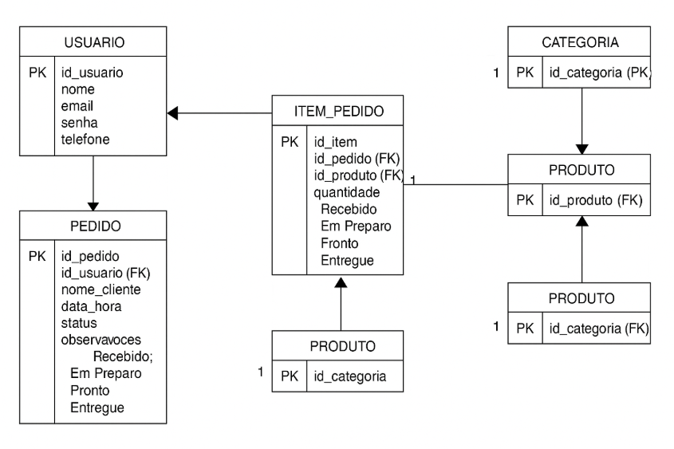

# DESCRIÇÃO DO PROJETO
O MenuMate é um sistema desenvolvido para facilitar o trabalho de balconistas, atendentes e telefonistas em estabelecimentos como lanchonetes, restaurantes, farmácias e mercados. Com uma interface simples, rápida e objetiva, o sistema permite que os profissionais registrem pedidos feitos presencialmente ou por telefone e os encaminhem automaticamente para os setores responsáveis pela produção ou separação.
# OBJETIVO DO PROJETO
  Simplificar e agilizar o processo de registro, organização e encaminhamento de pedidos feitos em estabelecimentos físicos ou por telefone. O sistema visa:

Reduzir erros no registro de pedidos;

Melhorar a comunicação entre atendimento e produção;

Aumentar a produtividade dos colaboradores;

Proporcionar uma experiência de atendimento mais eficiente e organizada.

# FERRAMENTAS A UTILIZAR
SQL Server: Gerenciamento de banco de dados para clientes, produtos, usuários e pedidos.

NetBeans: Desenvolvimento do sistema multiplataforma (desktop/mobile).

Pencil: Criação de protótipos das interfaces utilizadas pelos atendentes e pela produção.

GitHub: Controle de versão e colaboração entre os desenvolvedores.

Miro (Kanban): Planejamento e acompanhamento do progresso do projeto.

# FUNCIONALIDADES DO PROJETO

1. Cadastro e Login de Usuários
Cadastro de usuários por função: balconista, telefonista, produção, admin.

Controle de permissões por tipo de usuário.

2. Registro de Pedidos
Interface rápida para lançar pedidos presencialmente ou por telefone.

Seleção de produtos com categorias e quantidades.

Campo de observações adicionais (ex: "sem cebola", "com gelo", etc.).

3. Encaminhamento para Produção
Após finalização, os pedidos são enviados automaticamente para o setor de produção ou separação, com status "Em preparo".

4. Acompanhamento de Pedidos
Mudança de status do pedido: Recebido → Em preparo → Pronto → Entregue.

Visualização em tempo real do andamento de cada pedido.

5. Histórico de Pedidos
Acesso ao histórico de pedidos realizados por atendente ou por período.

Filtro por data, cliente, produto ou status do pedido.

6. Relatórios e Controle Administrativo
Painel de controle para visualizar volume de pedidos, produtos mais vendidos e desempenho de atendentes.

7. Cadastro de Produtos e Tabelas
Gerenciamento de catálogo de produtos com preços e categorias.

Atualizações em tempo real para todos os usuários.

 O diagrama representa o caso de uso do sistema MenuMate, destacando a interação do Cliente com suas funcionalidades principais:

Selecionar Produto: O cliente escolhe os itens desejados no sistema.

Definir Quantidade: Permite ao usuário ajustar a quantidade de cada produto selecionado.

Calcular SubTotal: O sistema calcula automaticamente o valor parcial do pedido com base na seleção do cliente.

Finalizar Compra: Conclui o processo de compra, garantindo o encaminhamento correto do pedido.

O diagrama lógico apresentado organiza a estrutura do banco de dados do sistema MenuMate, mostrando as relações entre suas tabelas principais.

Usuário: Armazena os dados dos atendentes e administradores que interagem com o sistema.

Pedido: Registra as solicitações feitas pelos clientes, associando cada pedido a um usuário responsável.

Item do Pedido: Detalha os produtos incluídos em cada pedido, indicando quantidade e identificação do item.

Produto: Contém as informações sobre os produtos disponíveis, vinculando-os a uma categoria específica.

Categoria: Classifica os produtos, facilitando a organização e seleção.

#	BANCO DE DADOS
2.1.1	Banco de Dados: SQL Server
O SQL Server foi escolhido como banco de dados para o projeto por várias razões, incluindo:
1.	Confiabilidade e Desempenho: O SQL Server é amplamente utilizado em projetos corporativos por ser robusto, escalável e garantir alto desempenho no gerenciamento de grandes volumes de dados.
2.	Segurança: Ele oferece recursos avançados de segurança, como criptografia de dados, auditoria e controle de acesso granular, essenciais para garantir a proteção de dados dos clientes e informações financeiras.
3.	Integração com o .NET: O SQL Server integra-se bem com o ambiente de desenvolvimento baseado em .NET (com o uso do NetBeans para o backend), facilitando a comunicação entre o aplicativo e o banco de dados.
4.	Facilidade de Administração: O SQL Server tem ferramentas de administração poderosas, como o SQL Server Management Studio (SSMS), para facilitar a gestão do banco de dados.
________________________________________
2.1.2	Dados a serem armazenados
A seguir, estão os dados principais que serão armazenados no banco de dados:
1. Tabela Usuario
Armazena os dados dos usuários do sistema, incluindo clientes e administradores.

Identificação única (id_cliente).

Dados pessoais como nome, email, CPF e data de nascimento.

O campo senha permite autenticação no sistema.

2. Tabela Produtos
Registra os produtos disponíveis para compra.

Cada produto possui um identificador único (id).

Informações como nome, estoque disponível, preço e tamanho são armazenadas.

3. Tabela Clientes
Mantém um cadastro de clientes com suas informações básicas.

Cada cliente possui um identificador único (id).

Dados incluem nome, CPF, email e telefone, garantindo uma comunicação eficiente.

4. Tabela Vendas
Registra as transações finalizadas.

Contém informações do cliente, detalhes do endereço (bairro, rua, número) e forma de pagamento.

O campo total calcula o valor final da compra.

data_venda é preenchido automaticamente com a data atual usando GETDATE().

Consultas SQL
As consultas SELECT permitem visualizar os dados das tabelas para análise.

SELECT * FROM Usuario; → Retorna todos os usuários cadastrados.

SELECT * FROM Produtos; → Exibe os produtos disponíveis.

SELECT * FROM Clientes; → Lista os clientes registrados.

SELECT * FROM Vendas; → Mostra as vendas realizadas.

Inserção de Dados
O comando INSERT INTO Usuario adiciona usuários ao sistema com seus respectivos dados.

CREATE DATABASE CardápioDigitalPersonalizado;
USE CardápioDigitalPersonalizado;

CREATE TABLE Usuario (
    id_cliente INT PRIMARY KEY IDENTITY(1,1),
    email VARCHAR(255) NOT NULL UNIQUE,
    senha VARCHAR(100) NOT NULL,
    nome VARCHAR(100) NOT NULL,
    cpf CHAR(14) NOT NULL UNIQUE,
    data_nascimento DATE
);
CREATE TABLE Produtos(
id INT PRIMARY KEY IDENTITY(1,1),
nome VARCHAR(50) NOT NULL,
estoque INT NOT NULL,
preco FLOAT NOT NULL, 
tamanho INT,
)
GO
CREATE TABLE Clientes(
id INT PRIMARY KEY IDENTITY(1,1),
nome VARCHAR(45) NOT NULL,
cpf CHAR(15) NOT NULL,
email VARCHAR(45) NOT NULL,
telefone VARCHAR(45) NOT NULL
)
GO

CREATE TABLE vendas (
    id INT PRIMARY KEY IDENTITY,
    cliente VARCHAR(100),
    bairro VARCHAR(100),
    rua VARCHAR(100),
    numero VARCHAR(20),
    total DECIMAL(10,2),
    forma_pagamento VARCHAR(20),
    data_venda DATETIME DEFAULT GETDATE()
);

SELECT * FROM Usuario;

select * from produtos

select * from Clientes

GO

INSERT INTO Usuario (email, senha, nome, cpf, data_nascimento)  
VALUES  
('joao.silva@email.com', 'senha123', 'João Silva', '123.456.789-00', '1990-05-15'),  
('maria.santos@email.com', 'maria456', 'Maria Santos', '987.654.321-00', '1985-09-22'),  
('carlos.rocha@email.com', 'carlos789', 'Carlos Rocha', '321.654.987-00', '1993-12-10');  

Telas Essenciais do Sistema
1. Tela de Login e Cadastro
Objetivo: Permitir que os clientes autentiquem-se ou criem uma nova conta para acessar o sistema.

Elementos:

Campos de entrada: E-mail e senha para login.

Botões: "Entrar", "Cadastrar", "Esqueci a senha".

Link: "Entrar como convidado" (para usuários sem conta).

Design: Interface simples e intuitiva, com destaque para o logotipo do restaurante.

Prioridade: Alta. Essencial para garantir que os usuários tenham acesso ao sistema.

2. Tela Principal (Home)
Objetivo: Apresentar o cardápio digital e permitir que o cliente explore as opções disponíveis.

Elementos:

Categorias de Cardápio: Entradas, pratos principais, sobremesas, bebidas, etc.

Imagens dos itens: Fotos e nomes dos pratos ou bebidas.

Preço e descrição: Informações detalhadas sobre os produtos.

Botão de filtro: Ordenação e busca personalizada de itens.

Prioridade: Alta. Fundamental para a experiência do usuário dentro do sistema.

3. Tela de Finalizar Pedido
Objetivo: Exibir os itens escolhidos pelo cliente e permitir ajustes antes da confirmação do pedido.

Elementos:

Lista de Itens Selecionados: Nome do prato, quantidade, preço.

Resumo do Pedido: Total parcial.

Botões: "Finalizar Pedido"

Métodos de Pagamento: Cartão, débito, Pix, etc.

Prioridade: Alta. Essencial para a conclusão do pedido de forma organizada e eficiente.
________________________________________
